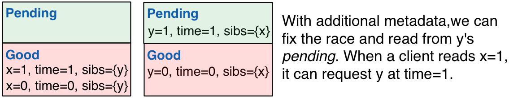

*tl;dr: You can perform non-blocking multi-object atomic reads and
 writes across arbitrary data partitions via some simple
 multi-versioning and by storing metadata regarding related items.*

**N.B. This is a long post, but it's comprehensive. Reading <a
  href="#putting_it_all_together">the first third</a> will give you
  most of the understanding.**

Performing multi-object updates is a common but difficult problem in
real-world distributed systems. When updating two or more items at
once, it's useful for other readers of those items to observe
atomicity: *either all of your updates are visible or none of them
are*.<a class="no-decorate" href="#atomicity-note">1</a>
This crops up in a bunch of contexts, from social network graphs
(e.g., [Facebook's Tao
system](http://hive.asu.edu/sigmod12/index.php?option=com_community&view=courses&task=viewpresentation&groupid=644&Itemid=0),
where bi-directional "friend" relationships are stored in two
uni-directional pointers) to distributed data structures like counters
(e.g., [Twitter's
Rainbird](http://www.slideshare.net/kevinweil/rainbird-realtime-analytics-at-twitter-strata-2011)
hierarchical aggregator) and secondary indexes (a topic for a future
post). In conversations I've had regarding our work on [Highly
Available
Transactions](http://www.bailis.org/blog/hat-not-cap-introducing-highly-available-transactions/),
atomic multi-item update, or transactional atomicity, is often the
most-requested feature.

#### Existing Techniques: Locks, Entity Groups, and "Fuck-it Mode"

The state of the art in transactional multi-object update typically
uses one of three strategies. 

 * You can use locks to update multiple items at once. Grab write locks
on update and read locks for reads and you'll ensure transactional
atomicity. However, in a distributed environment, the possibility of
partial failure and network latency means locking can lead to a Bad
Time&trade;.<a class="no-decorate" href="#lock-note">2</a>

 * You can co-locate distributed objects you'd like to update
together. This strategy (often called ["entity
groups"](http://www.cidrdb.org/cidr2011/Papers/CIDR11_Paper32.pdf))
makes transactional atomicity easy: locking on a single machine is
fast and not subject to the problems of distributed locking under
partial failure and network latency. Unfortunately, this solution
impacts data layout and distribution and does not work well for data
that is not easily partitioned (social networks, anyone?). 

 * You can use "fuck-it mode," whereby you simultaneously update all keys
without any concurrency control and hope readers observe transactional
atomicity. This final option is remarkably common: it scales well and
is applicable to any system, but it doesn't provide any atomicity
guarantees until the system stabilizes (i.e., converges, or is
eventually consistent).

In this post, I'll provide a simple alternative (let's call it
*Non-blocking Transactional Atomicity*, or NBTA) that uses
multi-versioning and some extra metadata to ensure transactional
atomicity without the use of locks. Specifically, our solution does
not block readers or writers in the event of arbitrary process failure
and, as long as readers and writers can contact a server for each data
item they want to access, the system can guarantee transactional
atomicity of both reads or writes. At a high level, key idea is to
avoid performing in-place updates and to use additional metadata to
substitute for synchronous synchronization across replicas.

## NBTA by Example

To illustrate the NBTA algorithm, consider the simple scenario where
there are two servers, one storing item `x` and the other storing item
`y`, both of which have value `0`. Say we have two clients, one of
which wishes to write `x=1`, `y=1` and another that wants to read `x`
and `y` together (i.e., `x=y=0` or `x=y=1`). (We'll discuss
replication later.)

#### *good*, *pending*, and Invariants

Let's split each server's storage into two parts: `good` and
`pending`. We will maintain the invariant that every write stored in
`good` will have its transactional sibling writes (i.e., the other
writes originating from the multi-put) present on each of their
respective servers, either in `good` or `pending`. That is, if `x=1`
is in `good` on the server for `x`, then, in the example above, `y=1`
will be guaranteed to be in `good` or `pending` on the server for `y`.

To maintain the above invariant, servers first place writes into
`pending`. Then, once servers learn (possibly asynchronously) that a
write's transactional siblings are all in `pending` (let's call this
process "learning that a write is stable"), the servers individually
move their respective writes into `good`. One simple strategy for
informing servers that a write is stable is to have the writing client
perform two rounds of communication: the first round places writes
into `pending`, then, once all servers have acknowledged writes to
`pending`, the client notifies each server that its write is
stable. (If you're nervous, this isn't two-phase commit; more on that
<a href="#so_what_just_happened">later</a>.)

#### Races and Pointers

We're almost done. If readers read from `good`, then they're
guaranteed to be able to read transactional siblings from other
servers. However, there's a race condition: what if one server has
placed its write in `good` but another still has its transactional
sibling in `pending`? We need a way to tell the second server to serve
its read from `pending`.

To handle this race condition, we attach additional information to
each write: a list of transactional siblings. At the start of a
multi-key update, clients generate a unique timestamp for all of their
writes (say, client ID plus local clock), which they attach to each
write, along with a list of the keys written to in the
transaction. Now, when a client reads from `good`, it will have a list
of transactional siblings with the same timestamp. When the client
requests a read from one of those sibling items, the server can fetch
it from either `pending` or `good`. If a client doesn't need to read a
specific item, the server can respond with the highest timestamped
item from `good`.

#### Putting it all together

We now have an algorithm that guarantees that all writes in a
multi-key update are accessible before revealing them to readers. If a
reader accesses a write, it is guaranteed to be able to access its
transactional siblings without blocking. This way, readers will never
stall waiting for a sibling that hasn't arrived on its respective
server. To make sure readers can access siblings in both `good` and
`pending`, we attached additional metadata to each write that can be
used by servers in the event of skews in stable write detection across
servers. If readers or writers fail, there is no effect on other
servers or other readers. Specifically, if writers fail, any partially
written multi-key updates will never become stable, and servers can
optionally guarantee write stability by performing `pending`
acknowledgments (i.e., performing the second phase of the client
write) for themselves.

## It Gets Better!

#### ...because optimizations are awesome...

There are several optimizations and modifications we can make to the
NBTA protocol:

 * *Size of* `pending` *and* `good`*:* if users want "last writer wins"
   semantics, there's no need to store more than one write in
   `good`. However, if we do this, a write's sibling may have been
   overwritten. If we want to prevent readers from reading "forwards
   in time" (e.g., read `x=0` then `y=1` then `x=1`, which preserves
   the property that once one write becomes visible, all of
   transaction's writes become visible but does not guarantee a
   consistent snapshot across items), then servers can retain items in
   `good` for a bounded amount of time (e.g., as long as a multi-item
   read might take) and/or clients can retry reads in the presence of
   overwrites.

* *Faster writes:* As I alluded to above, it's not necessary to have
  the client perform the second round of communication (which requires
  three message delays until visibility). Instead, servers can
  directly contact one another once they've placed writes in
  `pending`, requiring only two message delays. Alternatively, clients
  can issue the second round of communication asynchronously. However,
  to ensure that clients read their writes in these scenarios, they
  need to retain metadata until they have (asynchronously) detected
  that each write is in `good`.

* *Replication:* So far, I've only discussed having a single server
  for each data item. With "strong consistency" (i.e.,
  linearizability) per server, the above algorithm works fine. With
  asynchronous, or lazy, replication between servers (e.g., "eventual
  consistency"), there are two options. If all clients contact
  disjoint sets of servers (e.g., all clients in a datacenter contact
  a full set of replicas), then clients only need to update their
  local set of servers, and each set of servers can detect when writes
  are stable within their groups. However, if clients can connect to
  any server, then writes should only become stable whenever all
  respective servers have placed their writes in `good` or
  `pending`. This can take indefinitely long in the presence of
  partial failure.<a class="no-decorate"
  href="#ha-note">3</a>

 * *Read/write transactions:* I've discussed read-only and write-only
   transactions here, but it's easy to use these techniques for
   general-purpose read/write transactions. The main problem when
   aiming for models like ANSI Repeatable Read (i.e., snapshot reads)
   is ensuring that reads come from a transactionally atomic set: this
   can be done by pre-declaring all reads in the transaction and
   fetching all items at the start of the transaction or via fancier
   (and more expensive) metadata like vector clocks, which I won't get
   into here.

* *Metadata sizes:* The metadata required above is linear in the number
  of keys written. This is modest in practice, but metadata can also
  be dropped once all sibling writes are present in `good` (i.e.,
  there is no race condition for the transactional writes).

#### ...and it works in real life.

We've built a database based on LevelDB that implements NBTA with all
of the above optimizations except metadata pruning ([related
pseudocode here](../post_data/2013-05-28/ta-rc-pseudocode.png)). Under
the Yahoo! Cloud Serving Benchmark, NBTA transactions of 8 operations
each achieve between 33% (all writes) and 4.8% (all reads) of the
throughput of eventually consistent operation (and between 3.8% and
48% higher latency). Our implementation scales linearly, to over
250,000 operations per second for transactions of length 8 consisting
of 50% reads and 50% writes on a deployment of 50 EC2 instances.

In our experience, NBTA performs substantially better than lock-based
operation because there is no blocking involved. The two primary
sources of overhead are due to metadata (expected to be small for
real-world transactions like the Facebook and secondary indexing) and
moving writes from `pending` to `stable` (if, as in our
implementation, writes to `pending` are persistent, this results in
two durable server-side writes for every client-initiated
write). Given these results, we're excited to start applying NBTA to
other data stores (and secondary indexing).

#### So what just happened?

If you're a distributed systems or database weenie like me, you may be
curious how NBTA relates to well-known problems like two-phase commit.

The NBTA algorithm is a variant of uniform reliable broadcast with
additional metadata to address the case where some servers have
delivered writes but others have not yet, providing safety (e.g., [see
Algorithm
3.4](http://www.newbooks-services.de/MediaFiles/Texts/7/9783642152597_Excerpt_001.pdf)). Formally,
NBTA as presented here does not guarantee termination: servers may not
realize that a write in `pending` will never become
stable. Recognizing a "dead write" in `pending` requires failure
detection and, in practice, writes can be removed from `pending` once
sibling servers have been marked as dead, the server detects that a
client died mid-write, the write (under last-writer-wins semantics) is
overwritten by a higher timestamped write in `good`, or, more
pragmatically, after a timeout.

As presented here, servers can't `abort` updates. This isn't
fundamental. Instead of placing items in `pending`, servers can
instead reject updates, so any updates that were placed into `pending`
on other servers will never become stable. NBTA is weaker than a
[non-blocking atomic commitment
protocol](http://citeseerx.ist.psu.edu/viewdoc/download?doi=10.1.1.19.5491&rep=rep1&type=pdf)
because it allows non-termination for individual transactional updates
(that is, garbage collecting `pending` may take a while). The trick is
that, in practice, as long as independent transactional updates can be
executed concurrently (as is the case with last-writer-wins and as is
the case for all [Highly Available
Transaction](http://www.bailis.org/blog/hat-not-cap-introducing-highly-available-transactions/))
semantics, a stalled transactional update won't affect other
updates. In contrast, traditional techniques like two-phase commit
with two-phase locking will require stalling in the presence of
coordinator failure.

There are several ideas in the database literature that are similar to
NBTA. The optimization for reducing message round trips is similar to
the optimizations employed by [Paxos
Commit](http://research.microsoft.com/pubs/64636/tr-2003-96.pdf),
while the use of additional metadata to guard against concurrent
updates may remind you of [B-link
trees](http://www.cs.cornell.edu/courses/cs4411/2009sp/blink.pdf) or
other lockless data structures. And, of course, [multi-version
concurrency
control](http://research.microsoft.com/en-us/people/philbe/chapter5.pdf)
and [timestamp-based concurrency
control](http://citeseerx.ist.psu.edu/viewdoc/download?doi=10.1.1.142.552&rep=rep1&type=pdf)
have a long history in database systems. The key in NBTA is to achieve
transactional atomicity while avoiding a centralized timestamp
authority or concurrency control mechanism.

All this said, I haven't seen a distributed transactional atomicity
algorithm like NBTA before; if you have, please do [let me
know](http://www.bailis.org/contact.html).

## Conclusion

This post demonstrated how to achieve atomic multi-key updates across
arbitrary data partitions without using locks or losing the ability to
provide a safe response despite arbitrary failures of readers,
writers, and (depending on the configuration) servers. The key idea
was to establish an invariant that all writes have to be present on
the appropriate servers before showing them to readers. The challenge
was in solving a race condition between showing writes on different
servers---trivial for locks but harder for a highly available
system. And it works in practice--rather well, and much better than
similar lock-based techniques! If you've made it this far, you've
probably followed along, but I look forward to following up with a
post on how to perform consistent secondary indexing via similar
techniques---a potential killer application for NBTA, particularly
given that it's [often considered impossible in scalable
systems](https://cs.brown.edu/courses/cs227/archives/2012/papers/weaker/cidr07p15.pdf).

As always, feedback is welcomed and encouraged. If you're interested
in these algorithms in your system, let's talk.

*Thanks to [Peter Alvaro](https://twitter.com/palvaro), [Neil
 Conway](https://twitter.com/neil_conway), [Aurojit
 Panda](https://twitter.com/apanda), and [Shivaram
 Venkataraman](http://shivaram.info/), and [Reynold
 Xin](https://twitter.com/rxin) for early feedback on this post. This
 research is joint work with Aaron Davidson, [Alan
 Fekete](http://www.cs.usyd.edu.au/~fekete), [Ali
 Ghodsi](http://www.cs.berkeley.edu/~alig/), [Joe
 Hellerstein](http://db.cs.berkeley.edu/jmh/), and [Ion
 Stoica](http://www.cs.berkeley.edu/~istoica/) at UC Berkeley and the
 University of Sydney.*

Footnotes

<a
class="no-decorate" href="#atomicity-note">\[1\]</a>&nbsp; Note that
this "atomicity" is not the same as
[linearizability](http://en.wikipedia.org/wiki/Linearizability), the
data consistency property addressed in Gilbert and Lynch's [proof of
the CAP
Theorem](http://lpd.epfl.ch/sgilbert/pubs/BrewersConjecture-SigAct.pdf)
and often [referred
to](http://research.microsoft.com/en-us/um/people/lamport/pubs/interprocess.pdf)
as "atomic" consistency. Linearizability concerns ordering operations
with respect to real time and is a single-object guarantee. The
"atomicity" here stems from a database context (namely, the ["A" in
"ACID"](http://en.wikipedia.org/wiki/Atomicity_(database_systems))
and concerns performing and observing operations over multiple
objects. To avoid further confusion, we'll call this "atomicity"
"transactional atomicity."

<a
class="no-decorate" href="#lock-note">\[2\]</a>&nbsp; More
specifically, there are a bunch of ways things can get weird. If a
client dies while holding locks, then the servers should eventually
revoke the locks. This often requires some form of failure detection
or timeout, which leads to awkward scenarios over asynchronous
networks, coupled with effective unavailability prior to lock
revocation. In a linearizable system, as in the example, we've already
given up on availability, this isn't necessarily horrible, but it's a
shame to block readers during updates. If we're going for a highly
available (F=N-1 tolerant) setup (as we will <a
href="#because_optimizations_are_awesome">later on</a>), locks are
effectively a non-starter; locks are fundamentally at odds with
availability on all replicas during partitions. 

<a
class="no-decorate" href="#ha-note">\[3\]</a>&nbsp; Hold up, cowboy!
What does this replication mean for availability?  As I'll discuss
about&nbsp;<a href="#so_what_just_happened">soon</a>, we haven't
talked about when the effects of transactions will become visible in
the event of replica failures (i.e., when people will read my
writes). Readers will *always* be able to read transactionally atomic
sets of data items from non-failing replicas; however, depending on
the desired availability, reads may not be the most "up to date" set
that is available on some servers. The way to look at this trade-off
is as follows:
<ol class="footnote">
<li>You can achieve linearizability and
transactional atomicity, whereby everyone sees all writes after they
complete, but writes may take an indefinite amount of time to complete
("CP")</li> 
<li>You can achieve read-your-writes and transactional
atomicity, whereby you can see your writes after they complete, but
you'll have to remain "sticky" and continue to contact the same
(logical) set of servers during execution (your "sticky" neighboring
clients will also see your writes; "Sticky-CP")</li> 
<li>You can
achieve transactional atomicity and be able to contact any server, but
writes won't become visible until all servers you might read from have
received the transactional writes ("AP"; at the risk of sub-footnoting
myself, I'll note that there are cool and useful connections to
different kinds of [failure
detectors](http://pine.cs.yale.edu/pinewiki/FailureDetectors)
here).</li>
</ol>

Transactionally atomic [safety
properties](http://www.bailis.org/blog/safety-and-liveness-eventual-consistency-is-not-safe/)
are guaranteed in all three scenarios, but the safety guarantees on
*recency* offered by each vary. The main ideas presented here apply to
all three cases but were developed in the context of HA
systems.
